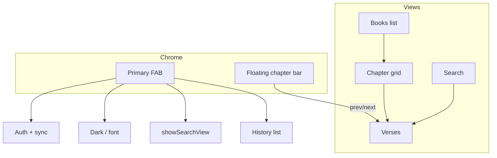

# feat: Bible floating nav, FAB, remove TTS/bookmarks, fuzzy search

## Overview

Refactor `bible.html` so reading uses the full viewport: remove the fixed toolbar and TTS chrome, delete bookmarks end-to-end, add a floating chapter navigation bar and a single FAB that hosts profile/sync, theme, font size, search, and history, lighten verse-number styling, and implement forgiving (normalized) search matching. (see origin: [docs/brainstorms/2026-04-21-bible-floating-controls-requirements.md](docs/brainstorms/2026-04-21-bible-floating-controls-requirements.md))

## Problem Frame

The current app spends two toolbar rows plus an audio bar on global actions and playback. Bookmarks and TTS add code weight and UI noise. The origin document calls for a reader-first layout with controls overlaid only when needed.

## Requirements Trace

- R1–R2: Remove TTS and related UI.
- R3–R4: Remove bookmarks from UI, storage flows, and sync semantics.
- R5a–R5d, R6: Floating nav bar with chapter prev/next (cross-book), disabled arrows at ends, book name → book list, chapter → chapter grid.
- R7–R8, R9–R10: Single FAB stack for former toolbar actions; remove fixed header; maximize content area.
- R11: Lighter verse-number color (light + dark).
- R12: Fuzzy / normalized search (e.g. `barjesus` vs `Bar-Jesus`).

## Scope Boundaries

- Non-goal: Changing Firebase project configuration, auth providers, or `bible.json` schema.
- Non-goal: Adding an automated test framework unless explicitly chosen later; verification is manual for this iteration.

### Deferred to Separate Tasks

- None identified.

## Context & Research

### Relevant Code and Patterns

- **Single-page shell:** `bible.html` holds markup, CSS, and an IIFE with Firebase, `State` (localStorage + Firestore sync), views (`showBooksView`, `showChaptersView`, `showVersesView`, `showSearchView`), `updateNav`, `pushNav` / `popstate`, and `buildSearchIndex` + `runSearch` (substring on `lower`).
- **Book order:** Canonical order matches `Object.keys(bibleData)` after load (same order as `bible.json` / `showBooksView` iteration).
- **Navigation state:** `currentBook` / `currentChapter`; `showChaptersView` sets `currentChapter` to `null`; `showSearchView` clears both; `showBooksView` clears both.
- **Sync:** `_scheduleSync` writes `dark`, `font`, `history`, `bookmarks`, `searchHistory` to Firestore; `applyCloudData` merges cloud into localStorage including bookmarks.
- **History UI:** `#btn-history` + `#history-menu` dropdown; profile uses `#profile-btn` + `#profile-menu` with `renderAuthArea`.

### Institutional Learnings

- No entries in `docs/solutions/` for this repo.

### External References

- None required for planning; optional: MDN `env(safe-area-inset-*)` for notched devices when polishing FAB/nav placement.

## Key Technical Decisions

- **Floating nav visibility (R6):** Show the **prev | book | chapter | next** bar only in the **verses** view, where chapter navigation is meaningful. Hide it on the book list, chapter grid, and search views so grids stay uncluttered; users rely on browser/PWA back where appropriate and the FAB for global actions. (Origin deferred “when visible”; this is the planned resolution.)
- **FAB interaction:** Use a **primary FAB** (e.g. lower corner) that toggles an **overlay panel** or **speed-dial stack** containing: account block (avatar, sync line, sign-in/out), toggles for dark mode and large text, and actions to open **Search** (navigate to `showSearchView`) and **History** (reuse `renderHistoryMenu` content in a panel or sub-menu). Keeps R7–R8 without one endless dropdown.
- **Chapter prev/next:** Derive ordered book list once from `Object.keys(bibleData)`. Previous: from `(book, ch)` go to `ch - 1` or last chapter of previous book; next: `ch + 1` or first chapter of next book. Disable + style arrows at Genesis 1 and last chapter of Revelation (or last book’s last chapter).
- **Bookmarks removal:** Remove bookmark keys from `doc.set` merges; stop treating bookmarks in `cloudHasData` / `localHasData` merge logic. Optionally delete `State` bookmark APIs and `bible_bm2` migration paths, or leave dead local keys unused—prefer **removing** bookmark methods and sync field to avoid confusion (R4).
- **Fuzzy search (R12):** Build a **normalized** string for each verse at index time (e.g. lowercase, strip punctuation/hyphens/Unicode separators; keep letters and numbers with a consistent rule). Normalize the query the same way. Match with `indexOf` on normalized strings. **Snippet highlighting:** Either align highlights using the index in the normalized string and map back to a character range in the raw verse (directional), or highlight the first **word token** from the query in the raw snippet—implementation chooses the simpler approach that preserves readable snippets.
- **Verse numbers (R11):** Introduce CSS variables for verse-number color in `:root` and `html.dark`, distinct from `--fg`, meeting at least **3:1** against background for UI text (tune in implementation).

## Open Questions

### Resolved During Planning

- **Where does full book list open from?** Resolved in origin: tap **book name** on floating bar.
- **When is floating nav shown?** Only on verses view (see Key Technical Decisions).

### Deferred to Implementation

- Exact FAB position (e.g. `bottom: 16px; right: 16px` + `env(safe-area-inset-*)`) and z-index relative to verse text.
- Whether to strip bookmark-related Firestore fields in a one-time client write vs. only stop sending updates—both satisfy “not advertising” sync; prefer omitting `bookmarks` from `set()` merge going forward.

## High-Level Technical Design

> *This illustrates the intended approach and is directional guidance for review, not implementation specification.*

## Implementation Units

- [ ] **Unit 1: Remove TTS and audio chrome**

**Goal:** Satisfy R1–R2 by deleting speech playback and all UI that exists only for TTS.

**Requirements:** R1, R2

**Dependencies:** None

**Files:**
- Modify: `bible.html`

**Approach:**
- Remove `#audio-bar` markup and `.audio-bar` / `.audio-setup` / `.verse.speaking` CSS.
- Delete the `tts` object, `showAudioSetup`, media session hooks, `speechSynthesis` usage, and listeners on `btn-audio`, `ab-*` controls.
- Remove any verse-level behavior that only served TTS (e.g. long-press if present only for audio).
- Remove toolbar button `#btn-audio` when the toolbar is still present (or as part of Unit 5 if done in one pass).

**Test scenarios:**
- **Happy path:** Open app, load verses — no audio bar, no 🔊 control, no TTS-related errors in console.
- **Edge case:** Navigate across books/chapters — no residual `speechSynthesis` calls.

**Verification:** Manual smoke: no audio UI; console clean on navigation.

---

- [ ] **Unit 2: Remove bookmarks from client UI and state**

**Goal:** Satisfy R3 by removing bookmark UX and client-side bookmark state handling.

**Requirements:** R3

**Dependencies:** Unit 1 may land before or in parallel; no hard dependency.

**Files:**
- Modify: `bible.html`

**Approach:**
- Remove bookmark CSS (`.verse-bm`, `.bm-*`, bookmarks view styles if isolated).
- Remove `showBookmarksView`, `showBmPopup`, bookmark list UI, `popstate` branch for `view === 'bookmarks'`, and verse bookmark buttons in `showVersesView`.
- Remove or stub `State` bookmark methods (`_bmData`, `getAllBookmarks`, `addBookmark`, lists, etc.) and `bible_bm2` / legacy migration usage; ensure no remaining calls throw.

**Test scenarios:**
- **Happy path:** Verses render without bookmark control; no bookmarks route.
- **Edge case:** Browser back from search/chapters does not reference bookmarks state.

**Verification:** No 🔖 UI; no errors when loading verses and searching.

---

- [ ] **Unit 3: Sync and cloud merge without bookmarks**

**Goal:** Satisfy R4 — bookmarks are not part of active sync or merge decisions.

**Requirements:** R4

**Dependencies:** Unit 2 (or synchronized edits) so `State` no longer depends on bookmarks.

**Files:**
- Modify: `bible.html`

**Approach:**
- Remove `bookmarks` from `_scheduleSync` payload.
- In `applyCloudData`, stop writing bookmark blobs to localStorage; adjust `cloudHasData` / `localHasData` in `onAuthStateChanged` so merge logic uses **history**, **dark**, **font**, **searchHistory** only (not bookmarks).
- Ensure first-time cloud hydration still works for preferences and history.

**Test scenarios:**
- **Integration:** Sign in with account that had cloud bookmarks — app loads without restoring bookmark UI; settings/history still merge per rules.
- **Happy path:** Signed-in user changes theme — Firestore document updates without `bookmarks` key (or with `bookmarks` omitted).

**Verification:** Firestore console or network inspection shows no bookmark reliance for app behavior.

---

- [ ] **Unit 4: Floating chapter navigation bar and cross-book chapter logic**

**Goal:** Satisfy R5a–R5d and R6 (visibility rule).

**Requirements:** R5a–R5d, R6

**Dependencies:** Units 1–3 complete or stubbed so `updateNav` can be refactored cleanly.

**Files:**
- Modify: `bible.html`

**Approach:**
- Add a fixed-position **nav bar** container (e.g. top or bottom of content area) with four interactive regions: prev, book label, chapter label, next. Style for thumb reach, z-index above `#view` scroll, `pointer-events` and safe-area padding as needed.
- Replace `nav-book` / `nav-chapter` / `nav-home` toolbar wiring: implement `updateFloatingNav()` called from `updateNav` / view transitions:
  - **Book tap** → `showBooksView()`.
  - **Chapter tap** → `showChaptersView(currentBook)` when `currentBook` set.
  - **Prev / next** → compute target `(book, chapter)` using ordered books array and per-book chapter counts; call `showVersesView(book, ch)`; disable buttons when no target (Genesis 1 prev, last chapter of last book next).
- Show bar **only** when `showVersesView` is active (hide when `currentChapter` is null or non-verses views). Reconcile with `updateNav` after `showSearchView` / `showBooksView` / `showChaptersView`.

**Technical design:** *Directional only:* `orderedBooks = Object.keys(bibleData)`; `prevChapter(book, ch)` returns `{ book, ch } | null`; same for `nextChapter`.

**Patterns to follow:** Existing `updateNav` + `pushNav` / `popstate` patterns.

**Test scenarios:**
- **Happy path:** Genesis 1 — prev disabled/gray; next → Genesis 2.
- **Edge case:** Chapter 1 of Exodus — prev → last chapter of Genesis.
- **Edge case:** Last chapter of Malachi — next → Matthew 1.
- **Happy path:** Tap book name → book list; tap chapter number → chapter grid for current book.
- **R6:** Book list and search show **no** floating chapter bar.

**Verification:** Manual matrix across OT/NT boundary and canon ends.

---

- [ ] **Unit 5: Remove toolbar, full-bleed layout, FAB menu stack**

**Goal:** Satisfy R7–R10 and relocate global actions.

**Requirements:** R7, R8, R9, R10

**Dependencies:** Unit 4 (floating nav) should exist so toolbar nav buttons are redundant.

**Files:**
- Modify: `bible.html`

**Approach:**
- Remove `.toolbar` markup and related CSS (`.toolbar-row`, `.tb` for header, etc.); adjust `body` / `#view` so content starts at the top (keep `#error` / `#loading` behavior).
- Add **FAB** button + panel: migrating `#profile-menu` content (auth, dark mode, large text) and wiring search/history into the panel—either nested dropdowns or sections with headings.
- Re-target `renderAuthArea`, `renderHistoryMenu`, and search opener to new FAB triggers; preserve `toggleMenu` / click-outside close behavior or equivalent for the new panel.
- Apply **full-bleed** intent: reduce or keep horizontal padding via `.view-inner` intentionally; ensure floating elements use `env(safe-area-inset-*)` where they sit flush to screen edges.
- Update `html.large-font` overrides that targeted `.toolbar-*` (remove or point at FAB).

**Test scenarios:**
- **Happy path:** Sign in/out, dark mode, large text from FAB; open search and history.
- **Integration:** Sync status line still updates on preference changes and online/offline.
- **Edge case:** Open FAB panel, scroll verses — panel closes or stays per chosen UX (document choice in code comments only if needed).

**Verification:** No fixed top bar; all former toolbar actions reachable from FAB; readable on narrow viewport.

---

- [ ] **Unit 6: Verse number color and fuzzy search**

**Goal:** Satisfy R11–R12.

**Requirements:** R11, R12

**Dependencies:** Search view still exists (Unit 5); index rebuild logic touched here.

**Files:**
- Modify: `bible.html`

**Approach:**
- **R11:** Set `.verse-num` color via new variables (e.g. `--verse-num`) in light/dark themes; ensure contrast vs `--bg` / verse background.
- **R12:** Extend `buildSearchIndex` to store a **normalized** text field; normalize query in `runSearch` the same way; match using normalized substring (or token strategy if substring too weak). Update snippet + `<mark>` logic so highlights still make sense—if exact-position mapping is costly, prefer highlighting the first query **word** in the raw snippet.
- Invalidate or rebuild `searchIndex` when normalization rules change (e.g. clear cache variable on load once).

**Test scenarios:**
- **Happy path:** Query `barjesus` finds verses containing `Bar-Jesus` in text.
- **Edge case:** Punctuation-only queries return empty or are ignored (min length unchanged, e.g. ≥2 meaningful chars).
- **R11:** Verse numbers visibly softer than body in light and dark modes.

**Verification:** Manual search checks + visual check of verse numbers.

## System-Wide Impact

- **Interaction graph:** `popstate` handler must drop bookmarks route; history stack URLs/states unchanged structurally but fewer branches.
- **Error propagation:** Auth and Firestore errors remain user-visible via existing patterns; removing fields should not throw `set` errors.
- **State lifecycle risks:** Clearing `searchIndex` when rebuilding for fuzzy fields; ensure no stale `lower`-only assumptions remain in `runSearch`.
- **API surface parity:** N/A (static site).
- **Integration coverage:** Auth + Firestore merge path after bookmark removal should be manually tested once.
- **Unchanged invariants:** `bible.json` fetch, `showVersesView` rendering pipeline (minus bookmarks), Firebase auth provider list.

## Risks & Dependencies

| Risk | Mitigation |
|------|------------|
| FAB/panels obscure verse text | High z-index only for chrome; padding-bottom on `#view` or `.view-inner` when FAB fixed bottom; safe-area insets. |
| Fuzzy highlight mis-aligns with snippet | Start with conservative highlighting; iterate if snippets look wrong. |
| Large single-file edit conflicts | Implement in unit order; keep commits per unit if using git. |

## Documentation / Operational Notes

- None required for a static HTML asset unless the site has a public README listing features—update externally if present.

## Sources & References

- **Origin document:** [docs/brainstorms/2026-04-21-bible-floating-controls-requirements.md](../brainstorms/2026-04-21-bible-floating-controls-requirements.md)
- **Primary implementation:** [bible.html](../../bible.html)
