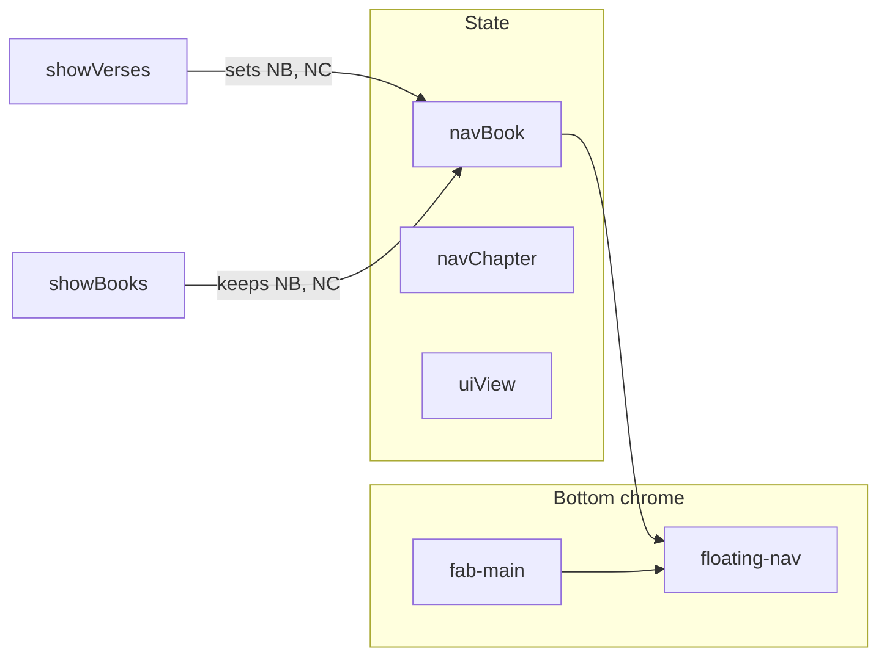

# feat: Always-on chapter chrome, FAB alignment, search snippet highlights

## Overview

Second pass on `bible.html` floating UI and search: keep the chapter navigation bar visible on every main view (R13), align the bar and FAB to one bottom row with matched height (R14), and fix search result snippets so fuzzy matches show the actual matched span in the verse preview (R15). (see origin: [docs/brainstorms/2026-04-21-bible-floating-controls-requirements.md](../brainstorms/2026-04-21-bible-floating-controls-requirements.md))

## Problem Frame

The first implementation hid the chapter bar outside verse view and stacked the FAB independently. Normalized search finds verses where the raw-text substring search fails, so previews often highlight the wrong span or a generic prefix—users cannot trust the list without opening each hit.

## Requirements Trace

- R13, R13b, R13c — Always-visible bar; persistent reading anchor; cold-start default.
- R14 — Same height + horizontal alignment for bar + FAB.
- R15 — Snippet shows real match with correct highlight bounds for fuzzy queries.

## Scope Boundaries

- Non-goal: Changing fuzzy matching rules (R12) beyond what is needed to locate highlights.
- Non-goal: New search ranking or backend index.

## Context & Research

### Relevant Code and Patterns

- `updateNav()` in `bible.html` gates visibility on `uiView === 'verses'` and `currentBook`/`currentChapter`.
- `showBooksView` / `showSearchView` null `currentBook` and `currentChapter`; `showChaptersView` sets chapter to `null`.
- `runSearch()` uses `searchIndex[i].norm.indexOf(qn)` but snippet logic uses `rawLower.indexOf(qLow)` with weak fallbacks.
- Markup: `#floating-nav` and `.fab-root` are siblings; CSS positions them independently.

### Institutional Learnings

- None in `docs/solutions/`.

## Key Technical Decisions

- **Reading anchor:** Introduce explicit **`navBook` / `navChapter`** (names illustrative) holding the bar’s canonical position. Update them in `showVersesView` when the user reads a chapter. Do **not** clear them when opening book list or search; only update when the user completes a navigation that implies a new chapter (e.g. verse view) or when choosing a chapter from the grid. On **cold start** after `bible.json` loads, set anchor to first book + first chapter in `Object.keys(bibleData)` order. `showChaptersView(book)` sets anchor book to `book`; chapter label can remain the last anchor chapter for that book if already in that book, else first chapter in book—finalize in implementation to avoid jarring jumps (defer edge polish if needed).
- **Prev/next from non-verse views:** Use the same anchor for `prevChapterNav` / `nextChapterNav` and optionally `showVersesView` to the target chapter when arrows fire (so arrows always move reading position and open verses)—matches user expectation of “chapter controls.”
- **Layout:** Wrap `#floating-nav` and FAB trigger in a single **bottom chrome** container (e.g. `.bottom-chrome`): `display: flex; align-items: center; justify-content: space-between` (or `flex-end` cluster + FAB), shared `min-height`, `padding-bottom: env(safe-area-inset-bottom)`. Remove conflicting independent `bottom` offsets that cause misalignment.
- **R15:** For each hit, compute **raw** start/end indices for the first `qn` match by walking `raw` once to build normalized output **with a parallel offset map** (each normalized index maps to an end offset in `raw`), or by scanning candidate start positions—prefer one linear pass per result for clarity. Reuse the same normalization rules as `normalizeSearchText`. Center snippet window on `[start, end]` with padding (~40 chars) and apply `<mark>` to `raw.slice(start, end)` for the match portion only.

## Open Questions

### Resolved During Planning

- **Tap book on bar from search:** Opens book list (existing behavior); anchor unchanged until user picks.

### Deferred to Implementation

- Exact behavior when `showChaptersView` is open for a new book and anchor chapter was for a different book—prefer resetting chapter display to `1` or first chapter for that book.

## High-Level Technical Design

> *Directional guidance for review, not a specification.*

## Implementation Units

- [x] **Unit 1: Reading anchor state**

**Goal:** Decouple “what the bar shows” from view-only nulling of `currentBook`/`currentChapter` (R13b, R13c).

**Requirements:** R13, R13b, R13c

**Dependencies:** None

**Files:**
- Modify: `bible.html`

**Approach:**
- Add variables (e.g. `navBook`, `navChapter`) initialized after data load to first book + first chapter.
- In `showVersesView`, set `navBook`/`navChapter` to the chapter being read (and keep `currentBook`/`currentChapter` as today for view logic if still needed).
- Stop clearing `navBook`/`navChapter` in `showBooksView` / `showSearchView`; adjust `showChaptersView` so the anchor’s book matches the grid’s book (chapter label policy per Key Decisions).
- Wire `fn-prev` / `fn-next` to update anchor and call `showVersesView` for the target chapter.

**Test scenarios:**
- **Happy path:** Open Genesis 1 → go to search → bar still shows Genesis 1; prev/next still work.
- **Edge case:** Fresh load → bar shows default book/chapter before any navigation.

**Verification:** Bar visible on book list and search; anchor stable across views.

---

- [x] **Unit 2: Always show chapter bar + `updateNav`**

**Goal:** Remove `uiView`/verse-only gating; drive labels and disabled state from anchor + `bibleData` (R13).

**Requirements:** R13

**Dependencies:** Unit 1

**Files:**
- Modify: `bible.html`

**Approach:**
- Change `updateNav()` to always show `#floating-nav` when `bibleData` is set; use `navBook`/`navChapter` for button text and `prevChapterNav`/`nextChapterNav`.
- Remove `.hidden` usage except perhaps before first load.

**Test scenarios:**
- **Happy path:** Books view with data loaded → bar visible.

**Verification:** No hidden bar on non-verse views.

---

- [x] **Unit 3: Bottom chrome layout (R14)**

**Goal:** One row, equal control heights, aligned with safe area.

**Requirements:** R14

**Dependencies:** Unit 2

**Files:**
- Modify: `bible.html`

**Approach:**
- Introduce a wrapper element around `#floating-nav` and `.fab-root` (or reposition nodes) so both share one flex row.
- Unify `min-height` (e.g. 52px) on `.floating-nav` buttons and `.fab-main`; vertical center; adjust `.view-inner` bottom padding to match combined chrome height.
- Remove duplicate `bottom` offsets that break alignment.

**Test scenarios:**
- **Happy path:** Bar and FAB visually level on mobile width.
- **Edge case:** Long book name ellipsis still aligns row height.

**Verification:** Visual check light + dark; safe-area not clipped.

---

- [x] **Unit 4: Search snippet match mapping (R15)**

**Goal:** Snippet `<mark>` covers the actual fuzzy match in raw text.

**Requirements:** R15

**Dependencies:** None (can parallelize with Unit 1–3)

**Files:**
- Modify: `bible.html`

**Approach:**
- Add a helper e.g. `findNormMatchInRaw(raw, qn)` returning `{ start, end }` in raw string indices, using the same normalization as `normalizeSearchText` and a deterministic mapping strategy (parallel norm build with index map, or verified scan).
- Refactor `runSearch` result loop to use these bounds for snippet slice and `<mark>`; widen context window around `[start, end]` for display.
- Keep result cap at 200; accept per-result extra work (linear in verse length).

**Test scenarios:**
- **Happy path:** Query `barjesus` vs verse text `Bar-Jesus` → mark covers `Bar-Jesus` in preview.
- **Edge case:** Multi-word query where norm matches across a space/punctuation boundary.

**Verification:** Manual searches that previously showed wrong/missing marks now show correct substring.

## System-Wide Impact

- **Interaction graph:** `pushNav` / `popstate` unchanged in spirit; ensure anchor updates do not break back stack.
- **State lifecycle:** Anchor must stay valid references into `bibleData` after merges.

## Risks & Dependencies

| Risk | Mitigation |
|------|------------|
| Anchor/book list desync | Validate book keys against `bibleData` before navigation |
| Perf on search | One O(n) pass per result row; acceptable at 200 hits |

## Sources & References

- **Origin document:** [docs/brainstorms/2026-04-21-bible-floating-controls-requirements.md](../brainstorms/2026-04-21-bible-floating-controls-requirements.md)
- **Prior plan:** [docs/plans/2026-04-21-001-feat-bible-floating-ui-plan.md](2026-04-21-001-feat-bible-floating-ui-plan.md)
