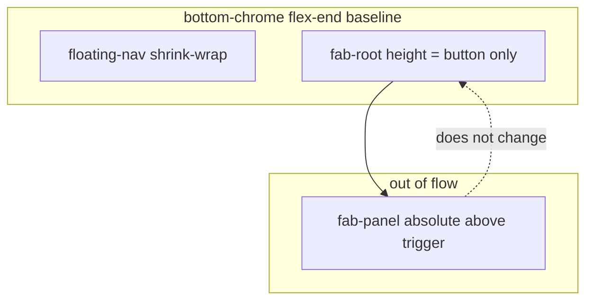

# feat: Stable FAB position + shrink-wrapped chapter bar (iteration 3)

## Overview

Adjust `bible.html` bottom chrome so opening the FAB menu does not shift the chapter bar or round menu button (R16–R17), and shrink the chapter navigation pill so its background hugs the controls instead of stretching across the row (R18). All changes stay in the existing single-page Bible shell; no behavioral changes to search, reading anchor, or FAB contents.

## Problem Frame

Iteration 2 placed the chapter bar and FAB in `.bottom-chrome`. The FAB panel is a flex child in a column with the trigger; when the panel opens, the column grows and `align-items: center` on the chrome row vertically re-centers siblings, so controls appear to move. The chapter bar also uses `flex: 1`, so its pill stretches horizontally.

See origin: [docs/brainstorms/2026-04-21-bible-iteration3-fab-chrome-requirements.md](../brainstorms/2026-04-21-bible-iteration3-fab-chrome-requirements.md).

## Requirements Trace

- **R16** — FAB trigger and chapter bar cluster stay fixed when the menu opens/closes (baseline vs viewport bottom / safe area).
- **R17** — Expanded panel overlays without shifting those controls (out-of-flow or equivalent).
- **R18** — Chapter pill wraps tightly around ← / book / chapter / → only; ellipsis for long book names remains acceptable.

## Scope Boundaries

- Non-goal: FAB panel content, auth, dark mode, or search/history logic.
- Non-goal: Iteration 2 reading-anchor or fuzzy search behavior.
- Non-goal: New animations beyond what is needed for correct layout/stacking.

## Context & Research

### Relevant Code and Patterns

- [bible.html](bible.html): `.bottom-chrome` (flex row, `align-items: center`, padding, safe area), `#floating-nav.floating-nav` (`flex: 1`, pill styling), `.fab-root` (column flex: `#fab-panel` then `#fab-main`), `.fab-panel` toggled with `.open`.
- No separate test suite for this static asset; verification is manual in browser (light/dark, narrow viewport).

### Institutional Learnings

- None referenced in `docs/solutions/` for this topic.

### External References

- None required; standard CSS overlay + flex alignment patterns.

## Key Technical Decisions

- **Panel out of flow:** Position `#fab-panel` (when open) so it does not contribute to `.fab-root`’s block-axis size. The layout height of `.fab-root` should match the trigger button alone. Use `position: absolute` anchored to `.fab-root` (which stays `position: relative`) with offsets that place the panel **above** the trigger (e.g. bottom edge of panel aligned above the button with a small gap), matching R17’s “dropdown” mental model.
- **Row baseline:** Set `.bottom-chrome` cross-axis alignment to **bottom** (`align-items: flex-end` or equivalent) so the chapter bar and FAB column share a stable baseline with the safe-area padding; once `.fab-root` height is constant, this prevents vertical drift when comparing open vs closed states.
- **DOM order:** If the current order (`fab-panel` before `fab-main`) complicates absolute positioning, reorder so the in-flow anchor is unambiguous (e.g. trigger first in DOM, panel after with absolute positioning), without changing IDs or JS hooks.
- **R18:** Remove horizontal growth from `#floating-nav`: drop `flex: 1` in favor of shrink-wrapped width (`max-content` / `fit-content` with existing `max-width` caps). Keep `.fn-book` ellipsis rules; optionally tighten `max-width` on the book label during implementation if the pill still feels oversized.

## Open Questions

### Resolved During Planning

- **Stacking / clipping (origin deferred):** Panel should sit above the trigger with `z-index` above `#view` content and within the same stacking context as existing chrome (`.fab-root` already `z-index: 130`). Ensure `overflow` on ancestors does not clip the panel; `overflow: visible` on `.bottom-chrome` / `.fab-root` unless a measured issue appears on iOS.
- **Long book names (origin deferred):** Keep existing `.fn-book` `max-width` (e.g. `42vw`) unless visual pass shows overflow; planning does not require a new cap unless implementation reveals clipping.

### Deferred to Implementation

- Exact `bottom` / `margin` / `max-height` values for the panel so it clears the trigger and respects `max-height` + scroll without overlapping the status bar on very small viewports (tune in browser).

## High-Level Technical Design

> *This illustrates the intended approach and is directional guidance for review, not implementation specification. The implementing agent should treat it as context, not code to reproduce.*

## Implementation Units

- [x] **Unit 1: FAB panel overlay + stable bottom row (R16, R17)**

**Goal:** Opening/closing the FAB does not move the chapter bar or the round button; the menu draws above the trigger without participating in flex sizing.

**Requirements:** R16, R17

**Dependencies:** None

**Files:**
- Modify: `bible.html` (styles + minimal markup reorder inside `.fab-root` if needed)

**Approach:**
- Make `.fab-root`’s laid-out height equal to the FAB trigger only: absolutely position `#fab-panel` relative to `.fab-root`, with visible panel opening **upward** toward the reading area.
- Set `.bottom-chrome` to bottom-align flex children (`align-items: flex-end`) so the row’s vertical alignment does not depend on varying sibling heights.
- Preserve `pointer-events` behavior on `.bottom-chrome` (children clickable).
- Confirm `#fab-main` / `#fab-panel` IDs and existing JS (`fabMain`, `fabPanel`, click handlers) remain valid after any markup reorder.

**Patterns to follow:**
- Existing z-index layering (`#view` below chrome); avoid clipping with accidental `overflow: hidden` on new wrappers.

**Test scenarios:**
- **Happy path:** FAB closed → note trigger position vs bottom safe area; open FAB → trigger and chapter bar positions unchanged (visual).
- **Edge case:** Long FAB panel content scrolls inside panel; trigger still fixed; panel does not push chrome row.
- **Integration:** Open FAB → Search → menu closes from existing flows; chrome still correct.

**Verification:**
- Manual check on a narrow viewport and with safe-area (iOS simulator or device if available): open/closed FAB, chapter bar visible, no vertical slide of controls.

---

- [x] **Unit 2: Shrink-wrapped chapter bar pill (R18)**

**Goal:** The floating nav background spans only the chapter controls, not empty flex space.

**Requirements:** R18

**Dependencies:** Unit 1 (same file; can land in same commit if preferred)

**Files:**
- Modify: `bible.html`

**Approach:**
- Replace `flex: 1` on `.floating-nav` with content-based width (`width`/`flex-basis`/`max-width` combination) so the pill does not stretch; retain `margin-right: auto` (or equivalent) to keep the cluster on the left and FAB on the right.
- Ensure short book names produce a visibly narrower pill; long names still ellipsis within existing or adjusted `max-width`.

**Patterns to follow:**
- Current `.fn-book` ellipsis and chapter button min widths.

**Test scenarios:**
- **Happy path:** Short book name (e.g. “John”) → pill width hugs buttons.
- **Edge case:** Long book name → ellipsis, pill does not span full row.
- **Edge case:** `.floating-nav.hidden` still hides bar without layout glitch when data loads.

**Verification:**
- Visual comparison before/after on ~375px width; no large empty colored region inside the pill.

## System-Wide Impact

- **Interaction graph:** Only layout/CSS and possible DOM order inside `.fab-root`; no changes to `showVersesView`, search, or history JS unless IDs break.
- **Unchanged invariants:** Reading anchor (`navBook`/`navChapter`), `updateNav`, Firebase auth, service worker registration.

## Risks & Dependencies

| Risk | Mitigation |
|------|------------|
| Absolute panel clips or sits under opaque ancestor | Check `overflow` on `body`/`#view`/wrappers; raise `z-index` only if needed |
| Markup reorder breaks `getElementById` | Keep same IDs; test FAB open/close and menu items |
| Chapter bar too narrow on some locales | Keep `max-width` on book label; adjust in implementation if unreadable |

## Documentation / Operational Notes

- None beyond optional one-line note in origin brainstorm if behavior is validated.

## Sources & References

- **Origin document:** [docs/brainstorms/2026-04-21-bible-iteration3-fab-chrome-requirements.md](../brainstorms/2026-04-21-bible-iteration3-fab-chrome-requirements.md)
- **Related plan:** [docs/plans/2026-04-21-002-feat-bible-chrome-align-search-snippets-plan.md](2026-04-21-002-feat-bible-chrome-align-search-snippets-plan.md)
